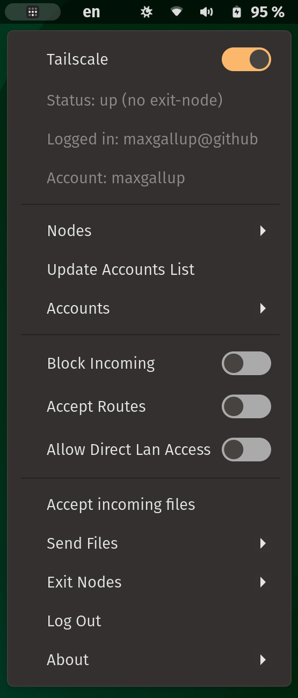

# Gnome Extension: tailscale-status
**This extension is in no way affiliated with Tailscale Inc.**

Easily manage your tailnets from a GUI gnome extension.
Thus, this requires that you have **setup tailscale beforehand**. 

### Features
* Copy address of any node by clicking it in the menu
    * 💻 - your own computer
    * 🟢 - online or idle
    * ⚫ - offline
* enable/disable incoming connections
* accept/reject subnet routes
* *if exit node:* allow direct access to local network
* Accept or send files with taildrop
* Connect through an available [exit node](https://tailscale.com/kb/1103/exit-nodes/)
* Switch accounts
* Set custom headscale server url via the preferences.

### Dependencies
This obviously **requires** [tailscale](https://tailscale.com) to work! 

### Installation
Official download from gnome-extensions: [https://extensions.gnome.org/extension/5112/tailscale-status/](https://extensions.gnome.org/extension/5112/tailscale-status/).

### Development
Download the `tailscale-status@maxgallup.github.com` directory and move it to `~/.local/share/gnome-shell/extensions/`.
Enable the extension in *Extensions* or *Extension Manager*.
You might have to log in and out for the extension to be loaded.

### Contribute
Feel free to open pull requests or raise issues, but please add a detailed description of exactly what is happening. Additionally please adhere to the [review guidlines](https://gjs.guide/extensions/review-guidelines/review-guidelines.html#basics) as much as possible.

