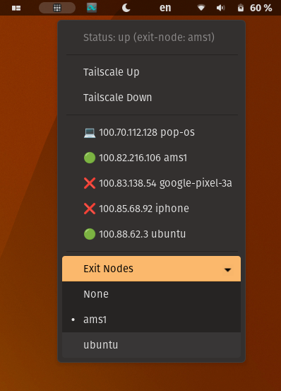

# Tailscale status gnome-shell-extension
**This extension is in no way affiliated with Tailscale Inc.**

Easily view the status of your tailscale mesh network and toggle the status of your own machine.
Thus, this requires that you have **setup tailscale beforehand**. 

The main menu shows the status of the various devices you have registered. Clicking on any of the
menu items will copy the IP address of that device to your clipboard.
* 💻 - your own computer
* 🟢 - online or idle
* ❌ - offline

Following that, there is a menu that shows available connections for using as an [exit node](https://tailscale.com/kb/1103/exit-nodes/).
Clicking on one of them will route all traffic through that exit node.

### Installation
This **requires** [tailscale](https://tailscale.com) to work!
Download the `tailscale-status@maxgallup.github.com` directory and move it to `~/.local/share/gnome-shell/extensions/`.
Enable the extension in *Extensions* or *Extension Manager*.
You might have to log in and out for the extension to be loaded.

### Contribution info
This has been tested with [PopOS 22.04](https://pop.system76.com/) and gnome 42 on a Lenovo Ideapad laptop. Feel free to open [pull requests](https://github.com/maxgallup/tailscale-status/pulls) to improve the extension!

### Todos
[ ] Test and support various distributions + Wayland support
[ ] Test and support older gnome-shell versions (< 42)
[ ] improve code readibility

