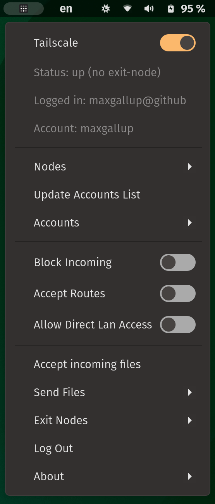

# Gnome Extension: tailscale-status
**This extension is in no way affiliated with Tailscale Inc.**

Easily manage your tailnets from a GUI gnome extension.
Thus, this requires that you have **setup tailscale beforehand**. 



### Compatibility: post-gnome45
* Due to breaking changes addded in Gnome45, two versions of this extension will have to be supported: [pre-gnome45](https://github.com/maxgallup/tailscale-status/tree/pre-gnome45) and [post-gnome45](https://github.com/maxgallup/tailscale-status/tree/post-gnome45). **This branch is post-gnome45.**

### Features
* Copy address of any node by clicking it in the menu
    * 💻 - your own computer
    * 🟢 - online or idle
    * ⚫ - offline
* enable/disable incoming connections
* accept/reject subnet routes
* *if exit node:* allow direct access to local network
* Accept or send files with taildrop
* Connect through an available [exit node](https://tailscale.com/kb/1103/exit-nodes/)
* Switch accounts
* Set custom headscale server url via the preferences.

### Dependencies
This obviously **requires** [tailscale](https://tailscale.com) to work! 

### Installation
Download the `tailscale-status@maxgallup.github.com` directory and move it to `~/.local/share/gnome-shell/extensions/`.
Enable the extension in *Extensions* or *Extension Manager*.
You might have to log in and out for the extension to be loaded.

Also, you can install this extension directly from the[ GNOME Extensions website](https://extensions.gnome.org/extension/4000/tailscale-status/).

### Contribute
Sadly, we must maintain two separate branches for before and after gnome 45 due to breaking changes. Make pull requests to the correct respective branch. Additionally, please adhere to the [review guidlines](https://gjs.guide/extensions/review-guidelines/review-guidelines.html#basics) as much as possible.

The Makefile includes useful targets for development. If running on wayland, use `make test-wayland` to open a nested gnome sessions.

If you want to contribute with new translations, follow these steps:

#### Compiling Translation
This extension uses `gettext` for i18n. If you modify or add a new `.po` file (e.g., `po_br.po`) in the `po/` directory, you must compile it into a `.mo` machine-object file before packing the extension.
Rum the folling command from the root of the repository:
```
msgfmt -cv -o po/tailscale-status.mo po/<your_language>.po
```

### TODOs
- [x] Rewrite extension to utilize tailscale api instead of running `tailscale` commands.
- [ ] Review api endpoints

